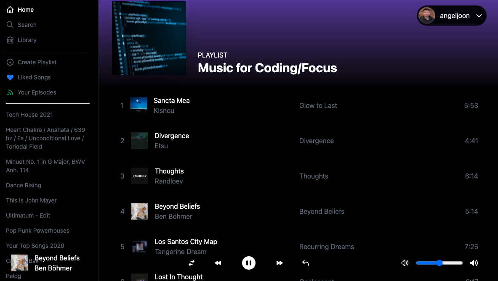

<!-- PROJECT LOGO -->
<br />

<div align='center'>

<br />

<h3>Sonic</h3>
<br />
<div>This app is a Spotify clone using Next.js, and the Spotify API. It lets you mirror music in a web browser and a compatible device. </div>
<br />
<p>
<a href='https://sonic-azure.vercel.app/'>
Try App
</a>
<br/>
<br/>
</p>

</div>
<br/>


## Technology:

* Next.js 12.0
* Next-Auth 4 Beta
* Spotify API
* Recoil
* Tailwind
* Vercel Deployment

## Instructions:

```
git clone https://github.com/adnjoo/Sonic
cd Sonic
npm install
npm run dev
```
